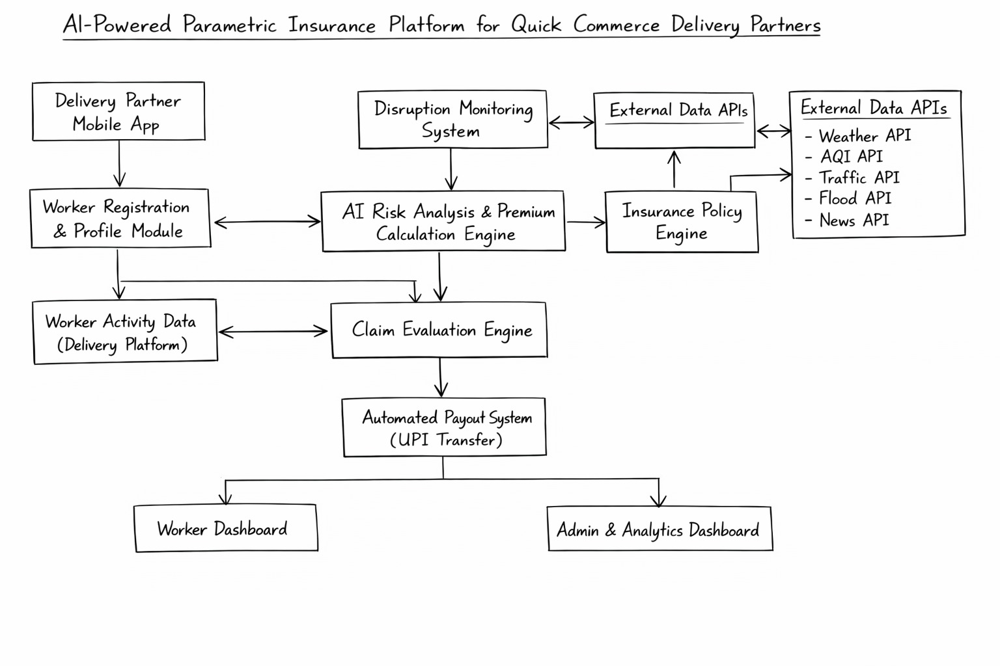
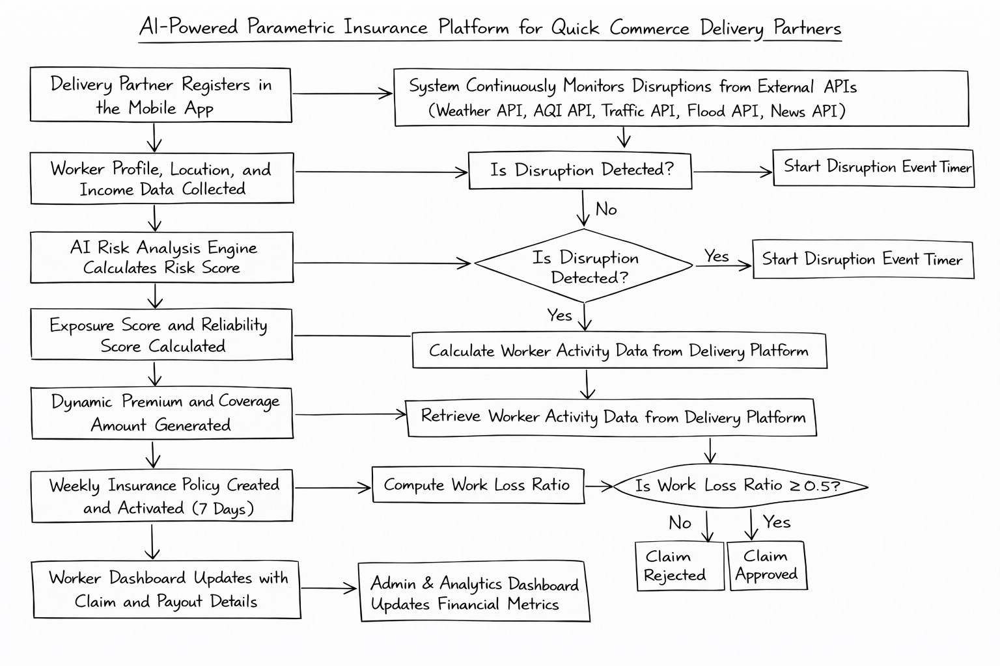

<h1 align="center">AI-Powered Parametric Insurance Platform</h1>
<p align="center">
Protecting Quick Commerce Delivery Partners from Income Loss
</p>

<p align="center">
  
  
  
</p>

---

## Problem

Quick commerce delivery partners (Blinkit, Zepto, Instamart) face **unexpected income loss** due to real-world disruptions such as:

- Heavy rain
- Floods
- Extreme heat
- Pollution
- Traffic congestion
- Dark store shutdowns

Currently, there is **no automated system** to compensate them for these disruptions.

---

## What We Don't Cover

As per problem constraints, this platform strictly excludes:

- Health insurance
- Life insurance
- Accident coverage
- Vehicle repairs

The system focuses only on income loss protection.

---

## Solution

We propose a parametric insurance platform with a zero-touch payout system.

- Real-time external data is monitored
- No manual claims are required
- Payouts are automatically triggered

This ensures fast, transparent, and reliable compensation.

---

## System Architecture

<p align="center">
  
</p>

---

## Workflow

<p align="center">
  
</p>

### Flow Summary

1. Worker registers and provides profile and income data
2. System computes risk and reliability scores
3. Weekly premium and coverage are generated
4. Policy is activated for a 7-day cycle
5. System monitors real-time disruptions
6. If conditions are satisfied, payout is triggered automatically

---

## Disruption Monitoring

The system continuously monitors:

- Weather API
- AQI API
- Traffic API
- Flood alerts
- News signals

Monitoring frequency: every 15 minutes.

---

## Claim Evaluation Logic

`WorkLossRatio = (ExpectedOrders - ActualOrders) / ExpectedOrders`

- If `WorkLossRatio >= 0.5` -> Claim approved
- Otherwise -> Claim rejected

---

## Payout System

- Zero-touch claim processing
- Instant payout via UPI (simulated)
- Real-time dashboard updates

---

## Key Features

- Weekly pricing aligned with gig economy
- Dynamic premium calculation
- Real-time disruption detection
- Automated claim triggering
- Fraud-resistant validation

---

## AI/ML Integration

- Risk prediction using historical disruption data
- Dynamic pricing based on zone-level patterns
- Fraud detection using anomaly detection:
  - GPS spoofing detection
  - Fake disruption claim detection

---

## Mathematical Framework

### Risk and Exposure

`RiskScore = sum(P_i * W_i)`

`ES = sum(P_i) / N`

---

### Reliability Score

`RS = (ActivityScore + CompletionScore + WorkHistoryScore + FraudScore) / 4`

`FraudScore = 1 - FraudFlags`

---

### Weekly Financial Model

CoverageFactor (CF):

`CF = 0.3 + 0.2 * RS + 0.1 * ES`

Weekly Premium:

`Premium = WeeklyIncome * CF * BaseRate * (1 + RiskScore)`

---

### Payout Logic

If `WorkLossRatio >= 0.5`:

`Final Payout = DailyIncome * PayoutPercent * DurationFactor`

`DurationFactor = DisruptionHours / 24`

---

## Phase 1 - Market Crash

### Security & Fraud Prevention

### Adversarial Defense & Anti-Spoofing Strategy

To address emerging fraud risks such as GPS spoofing and coordinated claim attacks, our platform integrates a multi-layered AI-driven anti-spoofing system that goes beyond basic location verification.

---

### 1. Differentiation: Genuine Worker vs Spoofed Actor

Our system does not rely solely on GPS coordinates. Instead, it builds a **behavioral and contextual trust model** for each delivery partner.

We differentiate real vs spoofed cases using:

- **Movement Consistency Analysis**
  - Real workers show continuous movement patterns (routes, stops, delivery paths)
  - Spoofed users show static or unrealistic jumps in location

- **Speed & Route Validation**
  - Compare movement with road network constraints (Google Maps data)
  - Detect impossible speeds or non-road movement

- **Historical Behavior Matching**
  - Compare current activity with worker’s past patterns
  - Sudden anomalies increase fraud probability

- **Order Activity Correlation**
  - Genuine workers show delivery lifecycle events (pickup → transit → drop)
  - Spoofers lack real order execution signals

---

### 2. Data Signals Beyond GPS

The system uses multiple data sources to detect spoofing:

#### Device & Sensor Data
- Accelerometer (movement detection)
- Gyroscope (device orientation changes)
- Network signal variation (cell tower changes)

#### Network Data
- IP address location vs GPS mismatch
- Frequent IP switching detection
- VPN/proxy usage signals

#### Operational Data
- Order assignment and completion logs
- App foreground/background activity
- Time spent active in delivery app

#### Environmental Correlation
- Compare reported location with:
  - actual weather severity
  - traffic conditions
- Detect mismatch (e.g., user claims flood but area is normal)

#### Group Fraud Detection
- Detect clusters of workers:
  - same location pattern
  - same claim timing
  - coordinated inactivity
- Use anomaly detection to flag fraud rings

---

### 3. AI-Based Fraud Risk Scoring

```text
FRS = f(LocationConsistency, MovementPattern, DeviceSignals,
        NetworkSignals, OrderActivity, HistoricalBehavior)
```
--- 

<h3>4. UX Balance: Fairness for Genuine Workers</h3>

<p>To avoid penalizing honest workers:</p>

<ul>
  <li><b>Grace Threshold Handling</b>
    <ul>
      <li>Temporary network drops do not immediately reject claims</li>
    </ul>
  </li>

  <li><b>Multi-Signal Validation</b>
    <ul>
      <li>No decision based on a single parameter</li>
    </ul>
  </li>

  <li><b>Soft Flagging System</b>
    <ul>
      <li>Claims marked as "Under Review" instead of rejected</li>
    </ul>
  </li>

  <li><b>Fallback Verification</b>
    <ul>
      <li>Worker can submit:</li>
      <ul>
        <li>App activity logs</li>
        <li>Delivery screenshots</li>
        <li>Manual confirmation</li>
      </ul>
    </ul>
  </li>

  <li><b>Delayed but Safe Payout</b>
    <ul>
      <li>Genuine claims may be slightly delayed, not denied</li>
    </ul>
  </li>
</ul>

--- 

<h3>5. System Impact</h3>

<p>This approach ensures:</p>

<ul>
  <li>Prevention of large-scale coordinated fraud</li>
  <li>Protection of insurer liquidity</li>
  <li>Fair treatment of honest workers</li>
  <li>Robust, scalable fraud detection system</li>
</ul>

<p>
By combining behavioral analytics, multi-source validation, and AI-based anomaly detection,
the platform becomes resilient against adversarial attacks such as GPS spoofing.
</p>

---

## Tech Stack

| Layer | Technology |
|-------|------------|
| Frontend | React |
| Backend | Flask |
| Database | MongoDB |
| APIs | Weather, Traffic, AQI |
| Payments | UPI (Simulated) |

---

## Detailed Documentation

Explore complete system design and mathematical models:

- [Idea Document](docs/QuickCommerce-InsuranceAI-Idea-Document.pdf)
- [Mathematical Models](docs/QuickCommerce-InsuranceAI-Mathematical-Model.pdf)

---

## Project Structure

```text
QuickCommerce-InsuranceAI/
|-- docs/
|-- src/
|-- backend/
|-- frontend/
`-- README.md
```

---

## Vision

To build a scalable, automated financial safety net for gig workers using data-driven parametric insurance principles.
